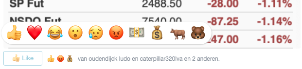

# Reactions Work plugin for Craft CMS 3.x

Allows users to submit a Facebook style reactions (like, love, haha, wow, sad, angry)
to any element.                                             

VISIT THE PLUGIN HOMEPAGE AT [https://io.24hoursmedia.com/reactions-work](https://io.24hoursmedia.com/reactions-work)

##  Features

* Users can apply the following reactions to content: like, love, haha, wow, sad, angry
* You can define and name up to 5 of your own additional reactions
* Show the users who most recently voted on a reaction
* Post reactions with a normal form (redirect endpoint) or with Ajax using a json response
* For Craft PRO edition because users need to be logged in to be able to react

* Suitable for large sites due to efficient storage of users who voted
* Voting urls are signed urls are signed and protected with a secret key to prevet tampering by robots or malicious users

----

Brought to you by [info@24hoursmedia.com](https://en.24hoursmedia.com)

Logo by https://www.iconfinder.com/ReactiveDoodlesApp
